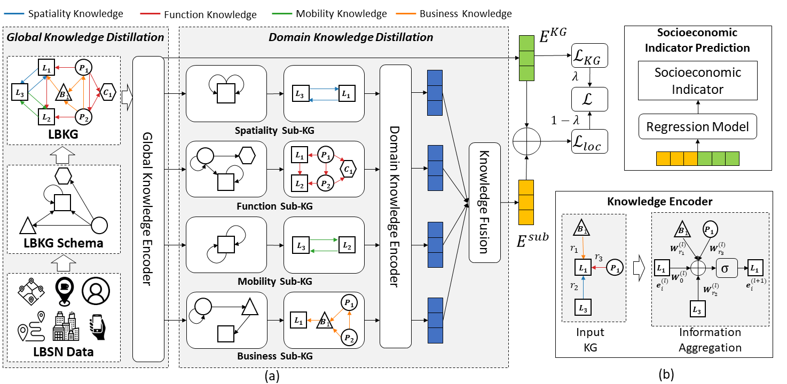

# KG for socioeconomic indicator prediction

This is the codebase for "[Hierarchical Knowledge Graph Learning Enabled Socioeconomic Indicator Prediction in Location-Based Social Network](https://dl.acm.org/doi/abs/10.1145/3543507.3583239)"(WWW'23).  
NYC dataset is included.

## Installation

### Environment
- Tested OS: Linux
- Python >= 3.8
- PyTorch == 1.9.0
- torch_geometric == 1.7.2

### Dependencies
1. Install PyTorch 1.9.0 with the correct CUDA version.
2. Use the ``pip install -r requirements.txt`` command to install all of the Python modules and packages used in this project.

## Usage
Please first download "mob-adj.npy" from [here](https://cloud.tsinghua.edu.cn/f/351fa77cc997486183c1/?dl=1) and put it into "./data/data_ny/" folder.

Train:

```
bash run.sh
```

Evaluate:

```
python evaluate.py
```

# Reference
If you found this library useful in your research, please consider citing:

```
@inproceedings{zhou2023hierarchical,
  title={Hierarchical knowledge graph learning enabled socioeconomic indicator prediction in location-based social network},
  author={Zhou, Zhilun and Liu, Yu and Ding, Jingtao and Jin, Depeng and Li, Yong},
  booktitle={Proceedings of the ACM Web Conference 2023},
  pages={122--132},
  year={2023}
}
```


